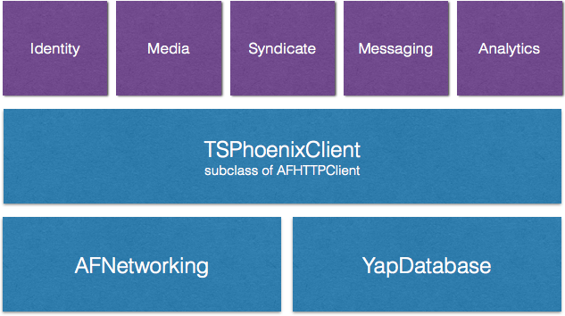

## Overview

Tigerspike Phoenix SDK (TSPhoenix) is an iOS SDK for [Tigerspike Phoenix Platform](http://developers.phoenixplatform.com/GettingStarted). It allows you to build iPhone / iPad apps on top of Phoenix Platform. By using the SDK instead of the HTTP APIs, you can save massive amount of development effort, interface with objective-level APIs and focus your time and energy on the UI.

- Native Objective-C APIs
- Native Objective-C models, with 100% coverage of Phoenix server side models
- Installation via CocoaPod
- Lightweight: TSPhoenix is a very thin layer built-on top of AFNetworking
- OAuth2: log in, out, auth tokens, etc.

## Design goals

- Plug and play, native Objective-C API
- Significantly less glue code
- Things that will be done over and over again should be automated
- Modular design, louse coupling for robustness
- Easy things easy, complicated things possible
- Avoid reinventing the wheel

## Architecture

TSPhoenix is a thin layer built on top of the networking and database layer. It includes **all** Phoenix data type models. It also includes a few helpers to make it easy to work with Phoenix APIs.

TSPhoenixClient is the Singleton entry point to SDK. It is a standard AFHTTPClient subclass. It also owns all Phoenix modules (identity, media, syndicate, messaging, analytics).

## Beta release

Tigerspike Phoenix SDK (TSPhoenix) for iOS is actively being developed. As a result, API design may change in the future. What this means is that if you have a project shipping 3-6 months down the road, you can start using the SDK today.

TSPhoenix is already powering Fuse which is a newsreader app. By using the SDK, Fuse developer offloads modelling, caching and networking entirely to TSPhoenix. This way, they can focus on delivering a killer user experience, and leave the data juggling to Phoenix.

## Status

- Installation: only Cocoapod supported at the moment
- Sample app: coming soon.
- Model generation: 100% working
- Model mapping JSON -> Objective-C: 100% working
- All contributions are welcome! Please use the "Issues" page to submit feedback.
- Or fork and submit Pull Requests
- Beta release
- Documentation is being baked
- Unit Testing is on the TODO list

## For the curious who wants to read some code

If you are interested in reading some Objective-C code, look into Source/ and Models/

If you are interested in how the models are automatically generated, look at Generators/

## Dependencies

Why, you ask? Why have dependencies in a SDK library?

The reason is simple: don't re-invent the wheel. We are already using AFNetworking for HTTP requests. YapDatabase is a solid key-value DB built on SQLite. If we roll our own networking and database, it will consume a ton of effort, and the result is not necessarily better. By leveraging the best open source components, 

[AFNetworking][afnetworking], ~>2.1

[afnetworking]: https://github.com/AFNetworking/AFNetworking

[YapDatabase][yapdb] ~> 2.3	Database (caching) layer in Phoenix SDK.

[yapdb]: https://github.com/yaptv/YapDatabase

[AFOAuth2Client][afoauth2]: Provides OAuth2 with Phoenix Identity. Using PhoenixPlatform's fork of this library.

[afoauth2]:https://github.com/phoenixplatform/AFOAuth2Client

## Full documentation is coming soon. Here are some examples to get you started:

### Setting up

In - applicationDidFinishLaunching:

    [TSPhoenixClient setUpWithBaseURL:[NSURL URLWithString:@"https://api.phoenixplatform.com.sg/"]
                             clientID:@"client_ID"
                         clientSecret:@"top_secret"
                            projectID:123];

Because Phoenix has been deployed across many regions (and more coming), we make the baseURL configurable to allow TSPhoenix to point to any region (.sg, .uk, ...) and any environment (dev, hat, live).

### Authenticating user

    [[TSPhoenixClient identity] authenticateWithUsername:self.userField.text
                                                password:self.passwordField.text
                                                 success:^(AFOAuthCredential *credential) {
                                                     // Token is automatically saved to keychain
                                                     // It's also auto restored between app launches
                                                 } failure:^(NSError *error) {
                                                     // Handle error
                                                 }];

### Getting the current user's profile

    NSString *path = @"identity/v1/users/me";
    [[TSPhoenixClient sharedInstance] GET:path
                               parameters:nil
                                  success:^(AFHTTPRequestOperation *operation, id responseObject) {
                                          NSDictionary *dict = [(AFJSONRequestOperation *)operation responseJSON];
                                          dict = dict[@"Data"][0];
                                          TSUser *user = [[TSUser alloc] initWithDictionary:dict];
                                          
                                          // Do something about the user
                                          
                                      } failure:^(AFHTTPRequestOperation *operation, NSError *error) {
                                          // Handle error
                                      }];

More examples available in the [wiki page](https://github.com/phoenixplatform/phoenix-ios-sdk/wiki/Making-API-Requests).

## Modules
### TSPhoenixClient

A **singleton** entry to all SDK modules. It is a standard AFHTTPClient subclass which handles all the underlying network traffic.
	[TSPhoenixClient sharedInstance]
	
all modules are a property of the shared instance, i.e.
	[TSPhoenixClient sharedInstance].identity
	[TSPhoenixClient sharedInstance].syndicate

### TSPhoenixIdentity

Phoenix Identity module, responsible for OAuth logging in / out, loading memberships, etc.

### TSPhoenixSyndicate

Phoenix Syndicate module, responsible for loading and caching sections / articles, sending article interactions back to Phoenix.

## Installation

Please read the [Phoenix Getting Started Guide](http://developers.phoenixplatform.com/GettingStarted) to get a basic understanding of Phoenix APIs. For a step-by-step tutorial, see [Getting Started][getting-started]

	pod 'PhoenixPlatform-iOS-SDK', :git => 'https://github.com/phoenixplatform/phoenix-ios-sdk.git', :branch => 'develop'

in Prefix.pch:

	#import <TSPhoenix/TSPhoenix.h>

in AppDelegate.m -appDidFinishLaunching:

	[TSPhoenixClient setUpWithClientID:…]

[getting-started]: https://github.com/phoenixplatform/phoenix-ios-sdk/wiki/Getting-Started

## Database: [YapDatabase][yapdb]

TSPhoenix provides out-of-the-box integration with YapDatabase. All model objects conform to NSCoding, meaning you can use TSPhoenix with other databases of your choice.

Why did we choose YapDatabase, not Core Data / FMDB / SQLite / ...

The criteria when choosing the database for TSPhoenix are:

- Robust. Ideally, the database requires **no** maintenance
- Flexibility. The DB should not break or complain if server-side model changes
- Straightforward. Work at the objects level, not DB table.
- Flexible & extensible

We evaluated many options, including Core Data and plain SQLite, among many others. 

Core Data doesn't work, because a). it enforces a strict schema, which requires migration between versions. b). there is no way to automatically generate .xcdatamodel from server models.  

Plain SQLite is very low level. We don't want people to learn SQL before they can use TSPheonix. They should be talking Cocoa (NSObjects), not tables, queries, etc.

From YapDatabase wiki:

> YapDatabase is a comprised of 2 main features:

> - a collection/key/value store built atop sqlite for iOS & Mac (the foundation)
> - a plugin architecture that provides for advanced functionality such as Views, Secondary Indexes, Full Text Search, etc.

This [page][yapdb-why] sums it up perfectly on why we need a key-value database for TSPhoenix.

[yapdb-why]: https://github.com/yaptv/YapDatabase/wiki/Why-did-we-create-YapDatabase

In the past few months, we put YapDatabase under stress, went though many version upgrades, changed the model multiple times. YapDB handled everything without breaking a sweat.

## Requirements

- Xcode 5
- iOS 7.0 SDK
- Deployment target >= iOS 6.1

## Contributing

We're following this [Git branching approach][git-branching-model]. If you'd like to send us a pull request, please follow the same model.

[git-branching-model]: http://nvie.com/posts/a-successful-git-branching-model/
